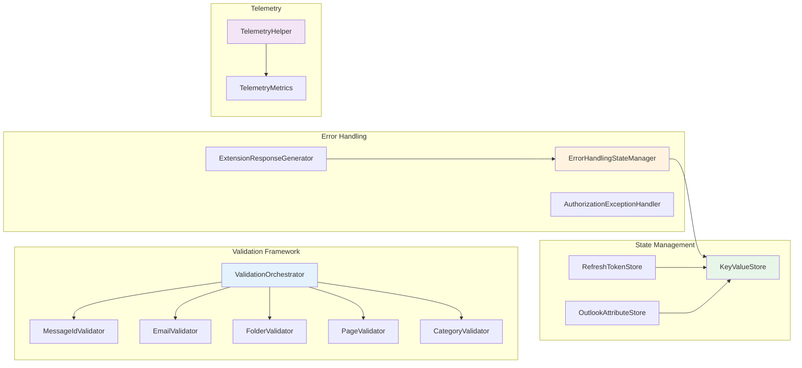
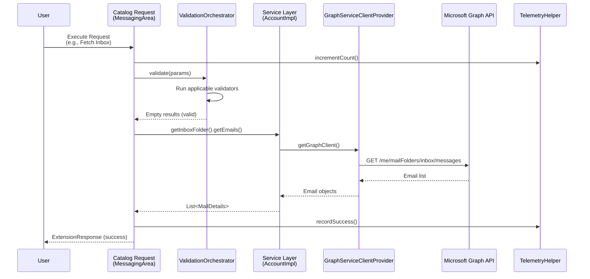
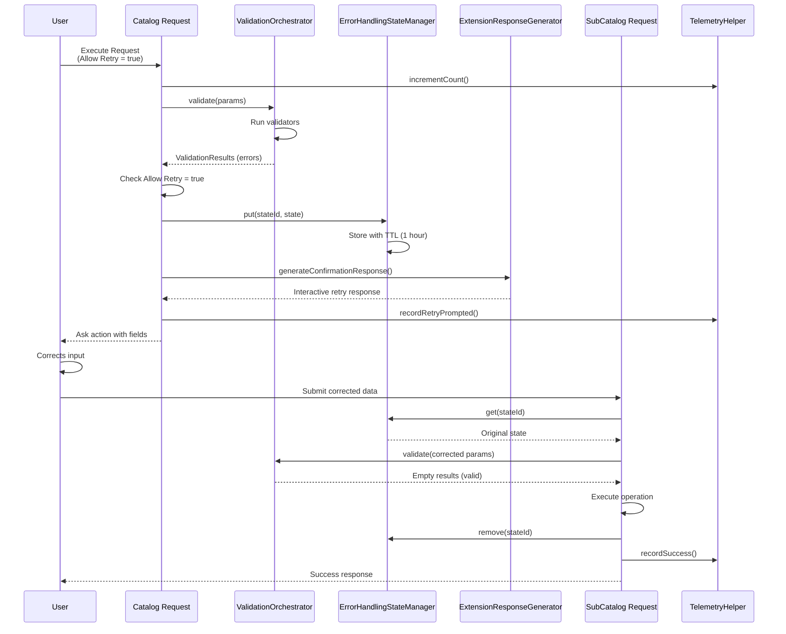

# Microsoft Outlook Extension - Architecture Documentation

**Version:** 3.0.20  
**Java Version:** Java 21  
**Domain:** Collaboration  
**Ecosystem:** Essentials  

---

## Table of Contents

1. [Overview](#overview)
2. [5-Layer Architecture](#5-layer-architecture)
3. [Component Architecture](#component-architecture)
4. [Data Flow Diagrams](#data-flow-diagrams)
5. [Authentication Flow](#authentication-flow)
6. [Validation & Error Handling](#validation--error-handling)
7. [State Management](#state-management)
8. [Performance Characteristics](#performance-characteristics)
9. [Error Scenarios](#error-scenarios)
10. [Deployment Architecture](#deployment-architecture)

---

## Overview

The Microsoft Outlook Extension is a comprehensive email management solution that integrates with Microsoft Graph API to provide full-featured email operations within the Krista platform. The extension follows a clean, layered architecture pattern with clear separation of concerns.

### Key Architectural Principles

- **Separation of Concerns**: Each layer has a distinct responsibility
- **Dependency Injection**: HK2-based DI for loose coupling
- **Fail-Fast Validation**: Input validation before API calls
- **Interactive Error Recovery**: User-friendly retry mechanism with state management
- **Telemetry-Driven**: Comprehensive metrics for monitoring and debugging
- **OAuth 2.0 Security**: Secure authentication with automatic token refresh

---

## 5-Layer Architecture

The extension is organized into 5 distinct layers, each with specific responsibilities:

```mermaid
graph TB
    subgraph "Layer 1: Extension Layer"
        A[OutlookExtension]
        A1[OutlookRequestAuthenticator]
        A2[Custom Tabs]
        A3[Test Connection]
    end
    
    subgraph "Layer 2: Catalog Request Layer"
        B[MessagingArea<br/>26 Requests]
        B1[SetupArea<br/>7 Requests]
        B2[MessagingAreaSubCatalogRequests<br/>15+ Retry Handlers]
    end
    
    subgraph "Layer 3: Service Layer"
        C[Account Interface]
        C1[Email Interface]
        C2[Folder Interface]
        C3[AccountImpl]
        C4[MessagingAreaImpl]
        C5[MailHandler]
    end
    
    subgraph "Layer 4: Integration Layer"
        D[GraphServiceClientProvider]
        D1[GraphServiceClientProviderFactory]
        D2[OAuthService]
        D3[RefreshTokenStore]
        D4[OutlookAttributeStore]
    end
    
    subgraph "Layer 5: External API"
        E[Microsoft Graph API]
        E1[/me/messages]
        E2[/me/mailFolders]
        E3[/me/subscriptions]
    end
    
    A --> B
    A --> B1
    B --> B2
    B --> C
    B1 --> C
    C --> C3
    C --> C4
    C --> C5
    C3 --> D
    C4 --> D
    C5 --> D
    D --> D1
    D --> D2
    D --> D3
    D --> D4
    D --> E
    E --> E1
    E --> E2
    E --> E3
    
    style A fill:#e1f5ff
    style B fill:#fff4e1
    style C fill:#e8f5e9
    style D fill:#f3e5f5
    style E fill:#ffebee
```

### Layer Descriptions

#### Layer 1: Extension Layer
**Purpose**: Entry point and extension lifecycle management

**Components**:
- `OutlookExtension`: Main extension class with DI setup
- `OutlookRequestAuthenticator`: Handles authentication requests
- Custom Tabs: Authentication and Documentation tabs
- Test Connection: Connection verification handler
- Invoker Removed: Cleanup on extension removal

**Responsibilities**:
- Extension initialization and dependency injection
- Request authentication delegation
- Custom UI tab registration
- Lifecycle event handling (test connection, invoker removed)

#### Layer 2: Catalog Request Layer
**Purpose**: Catalog request handlers and business logic orchestration

**Components**:
- `MessagingArea`: 26 messaging catalog requests
- `SetupArea`: 7 setup/configuration catalog requests
- `MessagingAreaSubCatalogRequests`: 15+ retry flow handlers
- `ValidationOrchestrator`: Centralized validation coordination
- `ErrorHandlingStateManager`: State management for retries
- `ExtensionResponseGenerator`: Response generation with retry flows

**Responsibilities**:
- Catalog request parameter validation
- Business logic orchestration
- Error handling and retry flow generation
- Telemetry recording
- State management for interactive retries

#### Layer 3: Service Layer
**Purpose**: Business logic abstraction and domain operations

**Components**:
- `Account` (Interface): Account-level operations
- `Email` (Interface): Email-specific operations
- `Folder` (Interface): Folder management operations
- `AccountImpl`: Account interface implementation
- `MessagingAreaImpl`: Messaging business logic
- `MailHandler`: Email entity transformation

**Responsibilities**:
- Domain logic implementation
- Entity transformation (Graph API ↔ Mail Details)
- Business rule enforcement
- Abstraction over integration layer

#### Layer 4: Integration Layer
**Purpose**: External API integration and authentication management

**Components**:
- `GraphServiceClientProvider`: Microsoft Graph API client
- `GraphServiceClientProviderFactory`: Client factory
- `OAuthService`: OAuth 2.0 flow implementation
- `RefreshTokenStore`: Token persistence
- `OutlookAttributeStore`: Configuration persistence
- `MailSubscription`: Webhook subscription management

**Responsibilities**:
- Microsoft Graph API client creation
- OAuth 2.0 authentication flow
- Token acquisition and refresh (MSAL4J)
- Configuration and token storage
- Webhook subscription lifecycle

#### Layer 5: External API Layer
**Purpose**: Microsoft Graph API endpoints

**Endpoints**:
- `/me/messages`: Email operations (list, get, send, reply, forward)
- `/me/mailFolders`: Folder operations
- `/me/messages/{id}/move`: Move messages
- `/me/messages?$search`: Search emails
- `/me/subscriptions`: Webhook subscriptions
- `/me/messages/delta`: Incremental sync

---

## Component Architecture

### Core Components Interaction



### Dependency Injection Graph

```mermaid
graph TD
    A[OutlookExtension] -->|@Inject| B[Invoker]
    A -->|@Inject| C[OutlookAttributeStore]
    A -->|@Inject| D[GraphServiceClientProviderFactory]
    A -->|@Inject| E[AuthorizationContext]
    A -->|@Inject| F[TelemetryMetrics]
    
    G[MessagingArea] -->|@Inject| H[Account]
    G -->|@Inject| I[RequestContext]
    G -->|@Inject| E
    G -->|@Inject| J[EventHandler]
    G -->|@Inject| K[MailHandler]
    G -->|@Inject| L[MessagingAreaImpl]
    G -->|@Inject| M[ExtensionResponseGenerator]
    G -->|@Inject| N[ErrorHandlingStateManager]
    G -->|@Inject| O[ValidationOrchestrator]
    G -->|@Inject| B
    G -->|@Inject| P[TestConnectionServiceImpl]
    G -->|@Inject| Q[TelemetryHelper]
    
    O -->|@Inject| H
    
    N -->|@Inject| R[KeyValueStore]
    
    style A fill:#ffcdd2
    style G fill:#c8e6c9
    style O fill:#bbdefb
    style N fill:#fff9c4
```

---

## Data Flow Diagrams

### Catalog Request Flow (Success Path)



### Catalog Request Flow (Validation Error with Retry)

