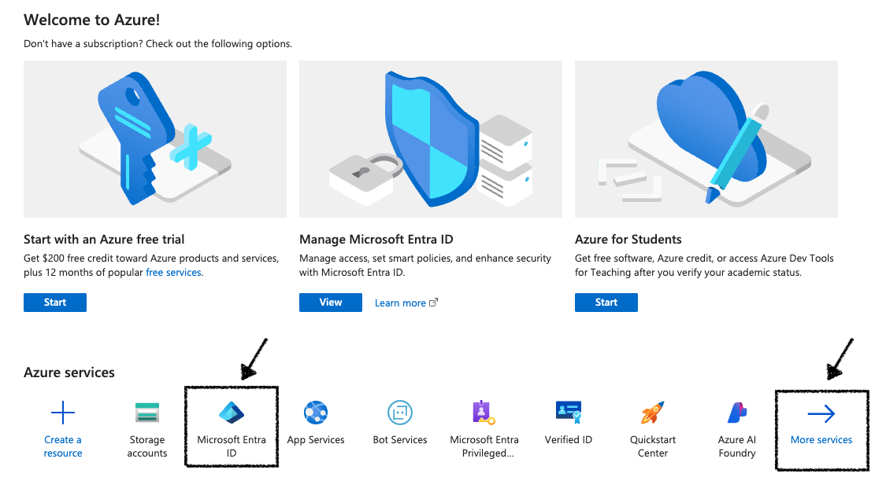
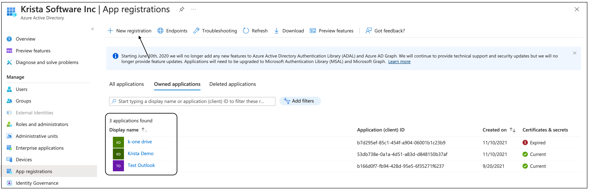
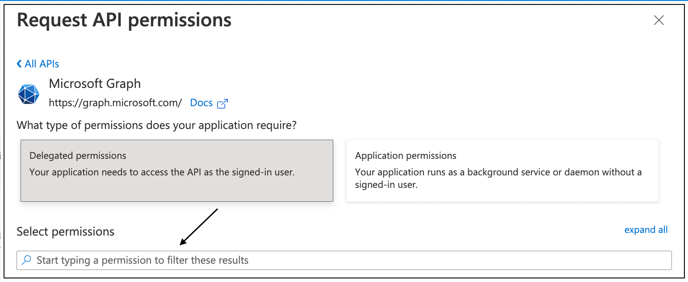
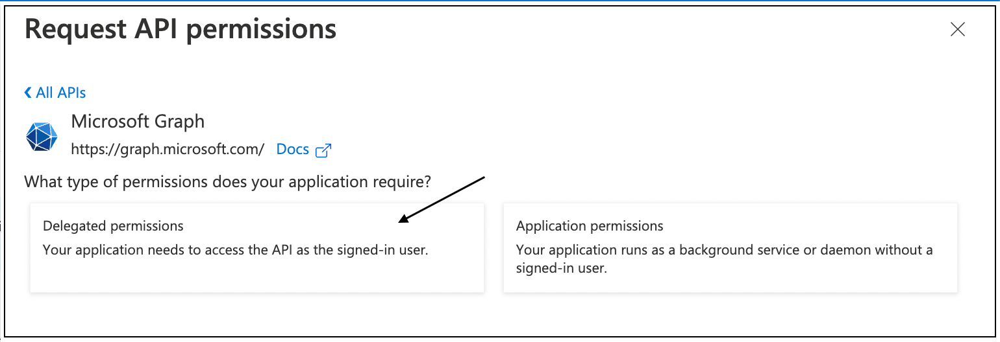
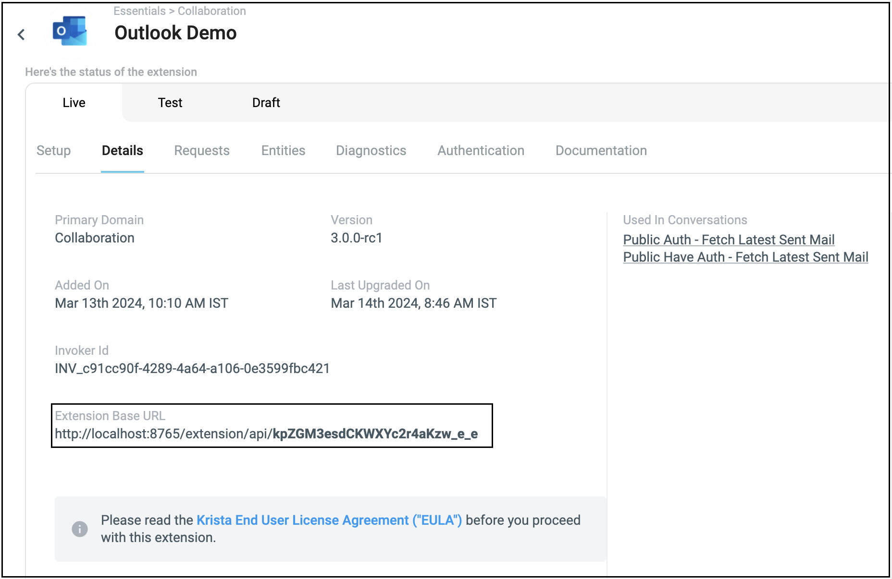

# Creating Outlook App

## Overview

This guide provides step-by-step instructions for creating a Microsoft Entra ID application required for Private
Authentication with the Outlook3 Extension. This process enables enterprise-grade security and full administrative
control over the email integration.

## Prerequisites

Before starting, ensure you have:

### Required Access

- **Microsoft Entra ID Administrator Role**: Global Administrator, Application Administrator, or Cloud Application
  Administrator
- **Azure Portal Access**: Access to https://portal.azure.com
- **Microsoft 365 Subscription**: Active subscription with Exchange Online
- **Tenant Permissions**: Ability to register applications in your Microsoft Entra ID tenant

### Required Information

- **Organization Details**: Tenant domain and directory information
- **Extension Details**: Krista extension base URL for redirect URI configuration
- **Email Account**: Administrator email that will be used for authentication

### Technical Requirements

- **Modern Browser**: Chrome, Firefox, Safari, or Edge
- **Internet Connectivity**: Required for Azure portal access
- **Administrative Privileges**: Sufficient permissions to create and configure applications

## Step-by-Step Application Creation

### Step 1: Access Azure Portal

1. **Navigate to Azure Portal**
    - Open your web browser
    - Go to https://portal.azure.com
    - Sign in with your Microsoft Entra ID administrator account

2. **Verify Tenant Context**
    - Check the directory name in the top-right corner
    - Ensure you're in the correct Microsoft Entra ID tenant
    - Switch directories if necessary

   

### Step 2: Navigate to App Registrations

1. **Access Microsoft Entra ID**
    - In the Azure portal, search for "Microsoft Entra ID"
    - Click on **Microsoft Entra ID** from the search results
    - This opens the Microsoft Entra ID overview page

2. **Open App Registrations**
    - In the left navigation menu, click **App registrations**
    - This displays all registered applications in your tenant

   

### Step 3: Create New Application Registration

1. **Start New Registration**
    - Click **+ New registration** at the top of the page
    - This opens the application registration form

   

2. **Configure Application Details**
    - **Name**: Enter a descriptive name (e.g., "Krista Outlook3 Extension")
    - **Supported account types**: Select "Accounts in this organizational directory only"
    - **Redirect URI**: Leave blank for now (will be configured later)

3. **Complete Registration**
    - Click **Register** to create the application
    - You'll be redirected to the application overview page

   

### Step 4: Configure API Permissions

1. **Access API Permissions**
    - In the application overview, click **API permissions** in the left menu
    - This shows currently granted permissions

2. **Add Microsoft Graph Permissions**
    - Click **+ Add a permission**
    - Select **Microsoft Graph** from the list
    - Choose **Delegated permissions**

   

3. **Select Required Permissions**
   Add the following permissions:
    - **Mail.ReadWrite**: Read and write access to user mail
    - **Mail.Send**: Send mail as a user
    - **offline_access**: Maintain access to data you have given it access to

   

4. **Grant Admin Consent**
    - After adding permissions, click **Grant admin consent for [Your Organization]**
    - Confirm the consent when prompted
    - Verify all permissions show "Granted for [Your Organization]"

   

### Step 5: Create Client Secret

1. **Access Certificates & Secrets**
    - Click **Certificates & secrets** in the left menu
    - This page manages application authentication credentials

   

2. **Add New Client Secret**
    - Under **Client secrets**, click **+ New client secret**
    - Provide a description (e.g., "Krista Extension Secret")
    - Select expiration period (recommended: 12 months)
    - Click **Add**

   

3. **Copy Client Secret Value**
    - **Important**: Copy the secret **Value** immediately
    - This value is only shown once and cannot be retrieved later
    - Store it securely for extension configuration

   

### Step 6: Collect Application Information

1. **Get Application IDs**
    - Navigate back to the **Overview** page
    - Copy the **Application (client) ID** - this is your Client ID
    - Copy the **Directory (tenant) ID** - this is your Tenant ID
    - Save these values for Krista configuration

   

2. **Configure Redirect URI in Krista Extension**
    - Navigate to the **Details** tab in your Krista extension
    - Copy the **Extension Base URL**
    - Append `/rest/outlook/callback` to create the full redirect URI
    - Example: `https://extension.company.com/rest/outlook/callback`

   

3. **Add Redirect URI to Microsoft Entra ID**
    - Go to **Authentication** in the left sidebar of your Microsoft Entra ID application
    - Click **Add a platform** > **Web**
    - Enter the complete redirect URI from step 2
    - Click **Configure** to save

   

4. **Verify Redirect URI Configuration**
    - Confirm your redirect URI is correctly configured in Microsoft Entra ID
    - Format should be: `https://your-extension-url/rest/outlook/callback`
    - Ensure exact match between Krista extension and Microsoft Entra ID

## Verification

### Verify Application Configuration

1. **Check Application Overview**
    - Application (client) ID is available
    - Directory (tenant) ID is available
    - Application name is descriptive and recognizable

2. **Verify API Permissions**
    - Mail.ReadWrite permission granted
    - Mail.Send permission granted
    - offline_access permission granted
    - Admin consent granted for all permissions

3. **Confirm Authentication Settings**
    - Redirect URI configured correctly
    - Matches extension callback URL exactly
    - Uses HTTPS protocol

4. **Validate Client Secret**
    - Client secret created and value copied
    - Expiration date noted for future renewal
    - Secret stored securely

### Test Application Setup

1. **Use Test Connection**
    - Configure the Krista extension with your application credentials
    - Use the [Test Connection](pages/TestConnection.md) catalog request
    - Verify successful authentication and API access

2. **Monitor Microsoft Entra ID Logs**
    - Check Microsoft Entra ID sign-in logs for authentication attempts
    - Verify no error messages or failed attempts
    - Confirm proper token issuance

## Security Considerations

### Application Security

1. **Client Secret Management**
    - Store client secrets securely (consider Azure Key Vault)
    - Set calendar reminders for secret expiration
    - Rotate secrets before expiration
    - Never expose secrets in code or logs

2. **Permission Management**
    - Grant only necessary permissions
    - Regularly review granted permissions
    - Remove unused permissions
    - Monitor permission usage

3. **Access Control**
    - Limit application access to necessary users
    - Use conditional access policies if available
    - Enable multi-factor authentication
    - Monitor application usage regularly

### Compliance and Auditing

1. **Audit Logging**
    - Enable Microsoft Entra ID audit logging
    - Monitor application sign-ins
    - Review permission grants regularly
    - Maintain access review processes

2. **Data Protection**
    - Understand data access scope
    - Implement data retention policies
    - Ensure compliance with organizational policies
    - Document application purpose and usage

## Troubleshooting

### Common Issues

#### Permission Errors

**Issue**: "Insufficient privileges to complete the operation"
**Solution**:

1. Verify you have Microsoft Entra ID administrator role
2. Check if tenant allows user consent
3. Request admin consent for permissions
4. Contact your Microsoft Entra ID administrator

#### Redirect URI Mismatch

**Issue**: Authentication fails with redirect URI error
**Solution**:

1. Verify redirect URI matches exactly
2. Check for HTTP vs HTTPS mismatch
3. Ensure no trailing slashes or extra characters
4. Confirm extension base URL is correct

#### Client Secret Issues

**Issue**: Authentication fails with invalid client error
**Solution**:

1. Verify client secret is copied correctly
2. Check if client secret has expired
3. Generate new client secret if needed
4. Ensure no extra spaces or characters

### Getting Help

If you encounter issues:

1. Review the [Authentication](pages/Authentication.md) guide for detailed troubleshooting
2. Check Microsoft Entra ID documentation for application registration
3. Contact your Microsoft Entra ID administrator for tenant-specific issues
4. Use the [Test Connection](pages/TestConnection.md) catalog request for diagnostics

## Next Steps

After successful application creation:

1. **Configure Extension**
    - Use the [Extension Configuration](pages/ExtensionConfiguration.md) guide
    - Enter your application credentials
    - Complete the authentication flow

2. **Test Setup**
    - Use [Test Connection](pages/TestConnection.md) to verify configuration
    - Test basic email operations
    - Verify permissions are working correctly

3. **Deploy to Production**
    - Document your configuration for team members
    - Set up monitoring and alerting
    - Plan for client secret rotation

## See Also

- [Extension Configuration](pages/ExtensionConfiguration.md) - Configure the extension with your application
- [Authentication](pages/Authentication.md) - Understand the authentication flow
- [Test Connection](pages/TestConnection.md) - Verify your setup is working
- [Microsoft Entra ID App Registration Documentation](https://docs.microsoft.com/en-us/entra/identity-platform/quickstart-register-app) -
  Microsoft's official guide
