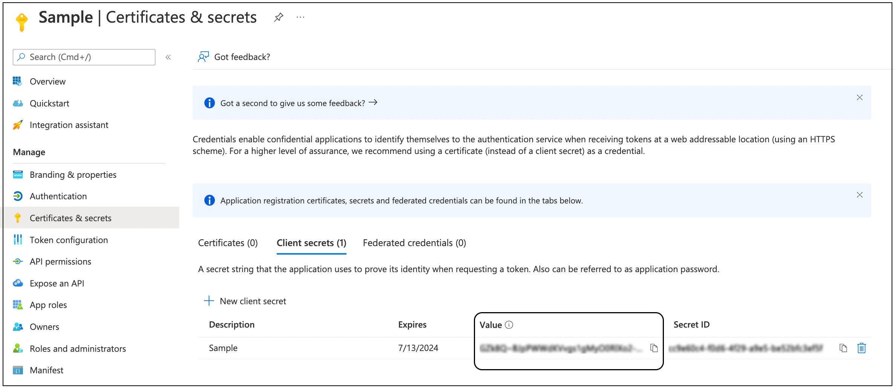

# Extension Configuration

## Overview

The Outlook3 Extension supports two distinct authentication modes to accommodate different security requirements and
deployment scenarios. This guide provides comprehensive setup instructions for both Public Authentication (simplified
setup) and Private Authentication (full OAuth 2.0 with Microsoft Entra ID).

## Authentication Modes Comparison

| Feature                             | Public Authentication | Private Authentication   |
|-------------------------------------|-----------------------|--------------------------|
| **Setup Complexity**                | Simple                | Advanced                 |
| **Microsoft Entra ID App Required** | No                    | Yes                      |
| **Security Level**                  | Standard              | Enterprise-grade         |
| **Use Case**                        | Testing, Development  | Production, Enterprise   |
| **Configuration Time**              | 5 minutes             | 30-60 minutes            |
| **Maintenance**                     | Minimal               | Regular token management |

## Public Authentication Setup

Public Authentication provides a simplified setup process perfect for testing and development environments.

### Prerequisites

- Active Microsoft Outlook account (Office 365, Outlook.com, or Exchange Online)
- Krista platform access with extension configuration permissions
- Internet connectivity for OAuth authentication

### Configuration Parameters

| Parameter        | Type    | Required | Description                                    | Example             |
|------------------|---------|----------|------------------------------------------------|---------------------|
| Email            | Text    | Yes      | Administrator email address for authentication | "admin@company.com" |
| Allow Alert Mail | Boolean | No       | Enable real-time email notifications           | true                |

### Step-by-Step Setup

#### Step 1: Access Extension Configuration

1. Navigate to your Krista platform
2. Go to **Extensions** > **Outlook3 Extension**
3. Click **Configure** or **Setup**

#### Step 2: Select Public Authentication

1. Choose **Public Authentication** mode
2. This mode uses Microsoft's public OAuth endpoints
3. No Microsoft Entra ID application registration required

#### Step 3: Enter Configuration Parameters

1. **Email**: Enter the administrator email address
    - Use the email account that will authenticate with Microsoft
    - This account will be used for all email operations
    - Ensure the account has necessary permissions

2. **Allow Alert Mail**: Check if you need real-time email notifications
    - Enables webhook-based email alerts
    - Required for real-time email processing workflows
    - Can be enabled/disabled later

#### Step 4: Authenticate with Microsoft

1. Click **Authenticate** or **Connect**
2. You'll be redirected to Microsoft's OAuth login page
3. Sign in with the email account specified in Step 3
4. Grant the requested permissions:
    - **Mail.ReadWrite**: Read and write access to mailbox
    - **Mail.Send**: Permission to send emails
    - **offline_access**: Maintain access when user is offline

#### Step 5: Verify Configuration

1. After successful authentication, you'll be redirected back to Krista
2. Verify the connection status shows as "Connected"
3. Test the connection using the [Test Connection](pages/TestConnection.md) catalog request

### Public Authentication Benefits

**Quick Setup**: No Microsoft Entra ID application required
**Simplified Management**: Minimal ongoing maintenance
**Perfect for Testing**: Ideal for development and testing environments
**Standard Security**: Uses Microsoft's public OAuth endpoints

## Private Authentication Setup

Private Authentication provides enterprise-grade security with full OAuth 2.0 implementation using your own Microsoft
Entra ID application.

### Prerequisites

- Microsoft Entra ID tenant with application registration permissions
- Active Microsoft Outlook account
- Krista platform access with extension configuration permissions
- Completed Microsoft Entra ID application setup (see [Creating Outlook App](pages/CreatingOutlookApp.md))

### Configuration Parameters

| Parameter        | Type    | Required | Description                                        | Example                                |
|------------------|---------|----------|----------------------------------------------------|----------------------------------------|
| Email            | Text    | Yes      | Administrator email address                        | "admin@company.com"                    |
| Client ID        | Text    | Yes      | Microsoft Entra ID Application (client) ID         | "12345678-1234-1234-1234-123456789012" |
| Client Secret    | Text    | Yes      | Microsoft Entra ID application client secret value | "abcdef123456..."                      |
| Tenant ID        | Text    | Yes      | Microsoft Entra ID Directory (tenant) ID           | "87654321-4321-4321-4321-210987654321" |
| Allow Alert Mail | Boolean | No       | Enable real-time email notifications               | true                                   |

### Step-by-Step Setup

#### Step 1: Complete Microsoft Entra ID Application Setup

Before configuring the extension, ensure you have completed the Microsoft Entra ID application setup:

1. Follow the [Creating Outlook App](pages/CreatingOutlookApp.md) guide
2. Collect the required credentials:
    - Application (client) ID
    - Client secret value
    - Directory (tenant) ID

#### Step 2: Access Extension Configuration

1. Navigate to your Krista platform
2. Go to **Extensions** > **Outlook3 Extension**
3. Click **Configure** or **Setup**

#### Step 3: Select Private Authentication

1. Choose **Private Authentication** mode
2. This mode uses your Microsoft Entra ID application for authentication
3. Provides full control over security and permissions

#### Step 4: Enter Configuration Parameters

1. **Email**: Enter the administrator email address
    - Use the same account that registered the Microsoft Entra ID application
    - This email will be used for service account authentication

2. **Client ID**: Paste the Application (client) ID from Microsoft Entra ID
    - Navigate to Microsoft Entra ID App Registration > Overview
    - Copy the **Application (client) ID** value

   

3. **Client Secret**: Paste the client secret value (not the secret ID)
    - Use the secret **Value** from Azure AD (not the secret ID)
    - This value is only shown once when created

   

4. **Tenant ID**: Paste the Directory (tenant) ID from Azure AD
    - Found in the same location as Client ID in Azure AD

5. **Allow Alert Mail**: Check if you need real-time email notifications

#### Step 5: Configure Redirect URI

1. Copy the **Extension Base URL** from the Details tab
2. Append `/rest/outlook/callback` to create the full redirect URI
3. Add this redirect URI to your Azure AD application:
    - Go to Azure AD App Registration > Authentication
    - Click **Add a platform** > **Web**
    - Enter the redirect URI: `https://your-extension-url/rest/outlook/callback`
    - Click **Configure**

#### Step 6: Validate Configuration

1. Click **Validate** in the extension setup
2. Complete the OAuth 2.0 authentication flow
3. **Authorize with the same administrator account** used for Azure AD registration
4. Verify successful authentication and token generation

#### Step 7: Test Connection

1. Navigate to the **Diagnostics** tab in the extension
2. Click **Test Connection** to verify the setup
3. Verify all connection tests pass successfully

### Private Authentication Benefits

**Enterprise Security**: Full OAuth 2.0 with your Microsoft Entra ID tenant
**Complete Control**: Manage permissions and access through Microsoft Entra ID
**Audit Trails**: Full logging through Microsoft Entra ID audit logs
**Compliance Ready**: Meets enterprise security requirements
**Scalable**: Supports multiple users and applications

## Security Considerations

### Public Authentication Security

- Uses Microsoft's public OAuth endpoints
- Standard OAuth 2.0 security protocols
- Suitable for development and testing environments
- Limited administrative control over authentication

### Private Authentication Security

- Full control through your Microsoft Entra ID tenant
- Enterprise-grade security policies
- Conditional access and multi-factor authentication support
- Complete audit trails and compliance reporting
- Advanced threat protection integration

### Best Practices

1. **Use Private Authentication for Production**
    - Always use Private Authentication for production deployments
    - Provides better security and administrative control

2. **Regular Token Management**
    - Monitor token expiration and refresh cycles
    - Implement proper error handling for authentication failures

3. **Principle of Least Privilege**
    - Grant only necessary permissions to the application
    - Regularly review and audit granted permissions

4. **Secure Credential Storage**
    - Store client secrets securely
    - Rotate client secrets regularly
    - Never expose credentials in logs or code

## Troubleshooting

### Common Configuration Issues

#### Authentication Failed

**Symptoms**: Unable to authenticate with Microsoft
**Causes**:

- Incorrect email address
- Account lacks necessary permissions
- Network connectivity issues

**Solutions**:

1. Verify email address is correct and accessible
2. Ensure account has mailbox access
3. Check network connectivity and firewall settings
4. Try authentication from different network/browser

#### Invalid Client Credentials (Private Auth)

**Symptoms**: "Invalid client" or "Authentication failed" errors
**Causes**:

- Incorrect Client ID, Client Secret, or Tenant ID
- Client secret expired
- Azure AD application misconfigured

**Solutions**:

1. Verify all credentials are copied correctly
2. Check if client secret has expired
3. Ensure Azure AD application is properly configured
4. Verify redirect URI matches exactly

#### Connection Test Failed

**Symptoms**: Test connection returns failure
**Causes**:

- Authentication not completed
- Insufficient permissions
- Microsoft Graph API issues

**Solutions**:

1. Complete authentication process first
2. Verify granted permissions include Mail.ReadWrite and Mail.Send
3. Check Microsoft Graph service status
4. Retry after a few minutes

### Getting Help

If you continue to experience issues:

1. Check the [Authentication](pages/Authentication.md) guide for detailed troubleshooting
2. Review the [Creating Outlook App](pages/CreatingOutlookApp.md) guide for Azure AD setup
3. Use the [Test Connection](pages/TestConnection.md) catalog request for diagnostics
4. Contact your Krista administrator for additional support

## Next Steps

After successful configuration:

1. **Test Your Setup**: Use the [Test Connection](pages/TestConnection.md) catalog request
2. **Explore Catalog Requests**: Start with basic operations like [Fetch Inbox](pages/FetchInbox.md)
3. **Build Workflows**: Combine multiple catalog requests for complex automation
4. **Monitor Performance**: Use built-in telemetry and logging for optimization

## See Also

- [Authentication](pages/Authentication.md) - Detailed authentication flows and troubleshooting
- [Creating Outlook App](pages/CreatingOutlookApp.md) - Azure AD application setup guide
- [Test Connection](pages/TestConnection.md) - Connection testing and validation
- [Send Mail](pages/SendMail.md) - Start with basic email sending functionality
