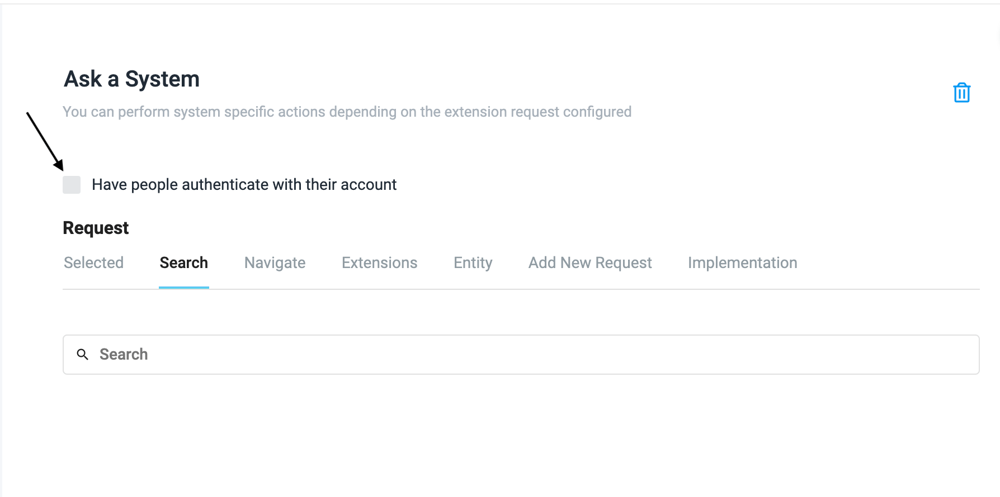
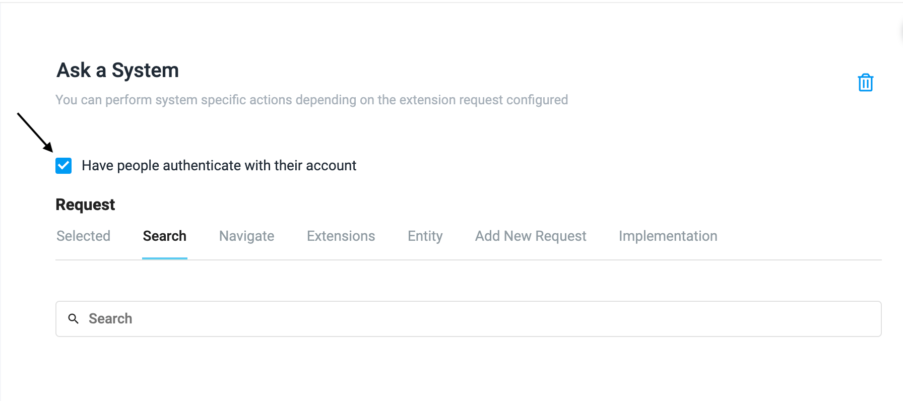

### Authentication

### Authentication as service account

* When you uncheck the **Have people authenticate with there account** checkbox, then the service account will be used while executing the conversation.This is the same account that is used and validated in extension set-up. 
  

### Authentication as user account

* When you check **Have people authenticate with there account** checkbox, you must authenticate with your account while executing the conversation.
  