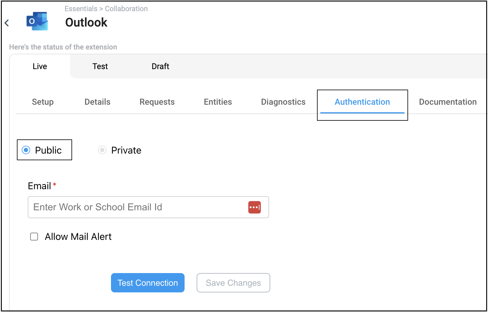
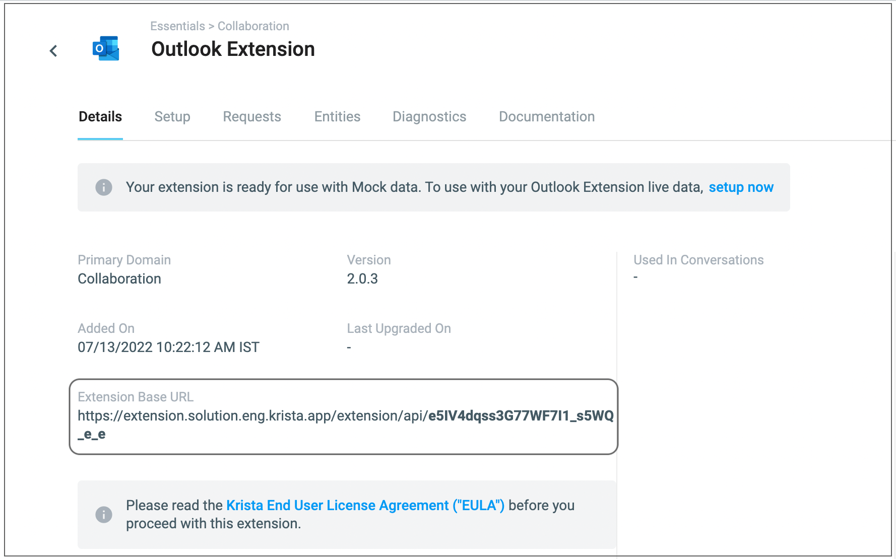
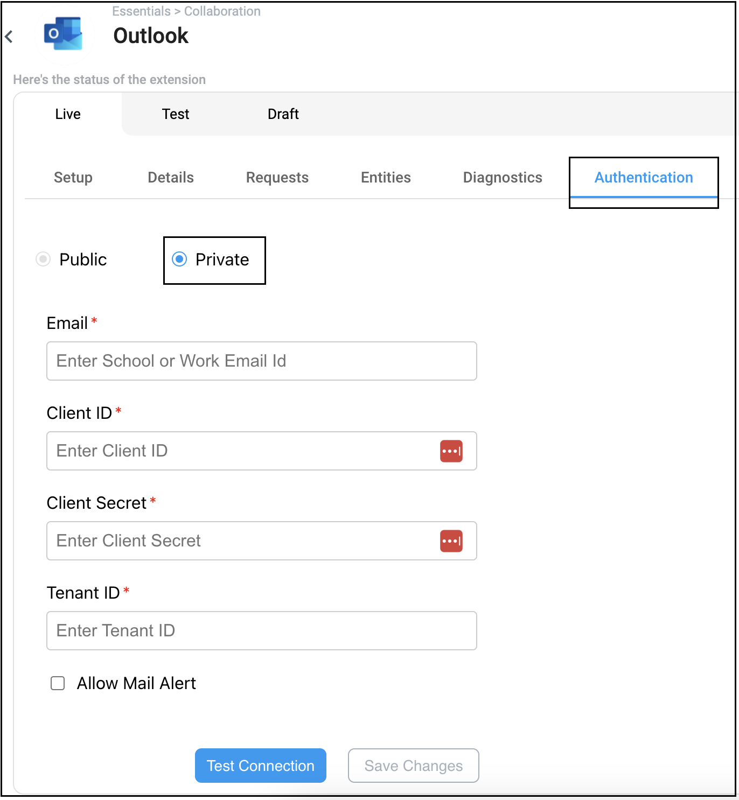

# Connecting with Krista Outlook Extension

To establish a connection with the Outlook Extension, follow the steps below based on your authentication method:

## Using Public Authentication

* Navigate to the Authentication tab in the Outlook Extension and select **Public**.
  

* You need to provide you school or work account mail id, then click on **Test Connection**.

* Once the Authentication is successful, click on **Save Changes**.

* Now you are good to use the extension for catalog requests.

## Using Private Authentication

* To set up the connection using private authentication, you must provide the Client ID, Client Secret, and Tenant ID
  from your registered web application on the Azure portal.

* Navigate to the Details tab in the Outlook Extension and copy the **Extension Base Url** and append *
  */rest/outlook/callback** at
  the end of Url, you need this url at the time of creating azure application.
  

* To obtain Client ID, Client Secret and Tenant ID, navigate to the **Obtaining Credentials For Private Authentication**
  page or [click here](obtainingClientIDClientSecret.md)

* Navigate to the Authentication tab in the Outlook Extension and select **Private**.
  

* Provide Email, Client ID, Client Secret and Tenant ID and click on **Test Connection**

* Once the Authentication is successful, click on **Save Changes**.

* On the extension set up page, click **Validate**. On the resulting Authentication tab, authorize with the same account
  details that you registered application with, on the Azure portal.

* Now you are
  good to go for the extension requests.
