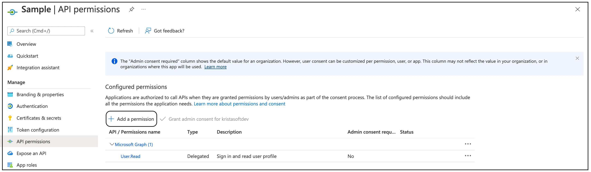

# Obtaining Credentials for Private Authentication

To use the Outlook Extension, you need to obtain the **Client ID**, **Tenant ID**, and **Client Secret** from the Azure Portal.

---

### Steps to Get Client ID, Tenant ID, and Client Secret

1. Log in to the [Azure Portal](https://portal.azure.com/).  
   

2. Under **Azure Services**, click on **Azure Active Directory**.  
   If it's not readily visible, click **More Services** to find it.  
   

3. In the **Overview** section, click **App registrations** under the **Manage** menu.  
   

4. At the top of the page, click **New Registration**.  
   Alternatively, open your existing application.  
   

5. On the **Register an application** page:
  - Enter a **Name** (this will be the display name of your app).
  - Under **Supported account types**, choose **Accounts in this organizational directory only** (single tenant).
  - Under **Redirect URI**, select **Web** and enter the redirect URI copied from the **Details** tab in the Outlook Extension.  
    Click **Register**.  
    

6. After registration, go to the **Overview** tab.  
   Under **Essentials**, you will find the **Client ID** and **Tenant ID**.  
   

7. Click **API Permissions**. Under **Configured permissions**, click **Add a permission**.
  

8. On the **Request API permissions** page, select **Microsoft Graph**.
  

9. Select **Delegated Permissions**.
  

10. Start typing permission name and select the following permissions after you see.
    * openid
    * offline_access
    * profile
    * User.read
    * Mail.Send
    * Mail.ReadWrite
    * Mail.Send.Shared
    * Mail.ReadWrite.Shared

  

11. Navigate to **Certificates & secrets**, and click on **New client secret**.  
   

12. In the **Add a client secret** panel:
  - Enter a **Description**.
  - Set the **expiration period** in the **Expires** field.
  - Click **Add**.  
    

13. After adding, the **Client Secret** will appear under the **Value** column.  
   

14. Save the **Client ID**, **Tenant ID**, and **Client Secret** securely for future reference.

15. You will need to provide these values in the extension to proceed with operations like **catalog requests** and **invoker requests**.
