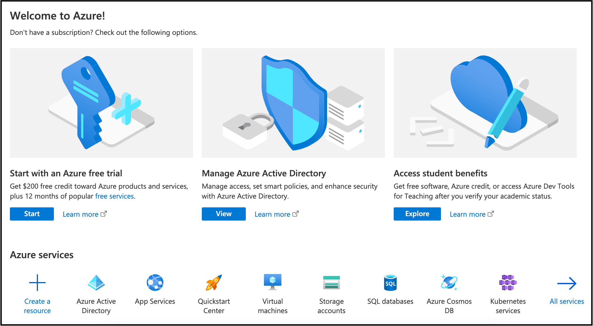
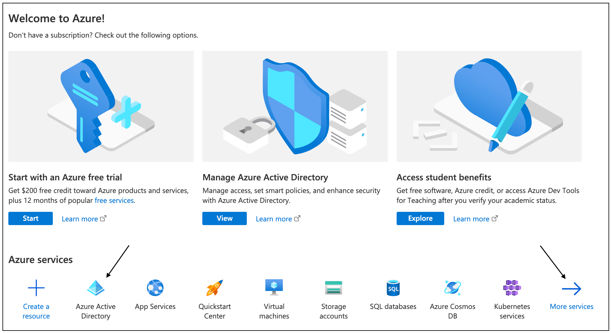
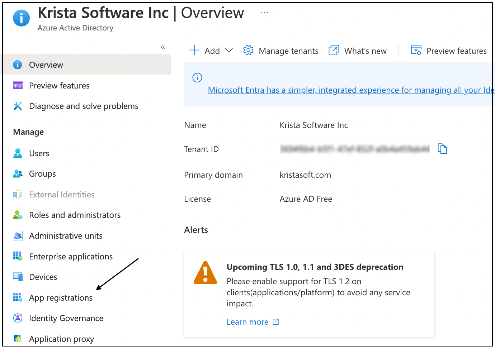
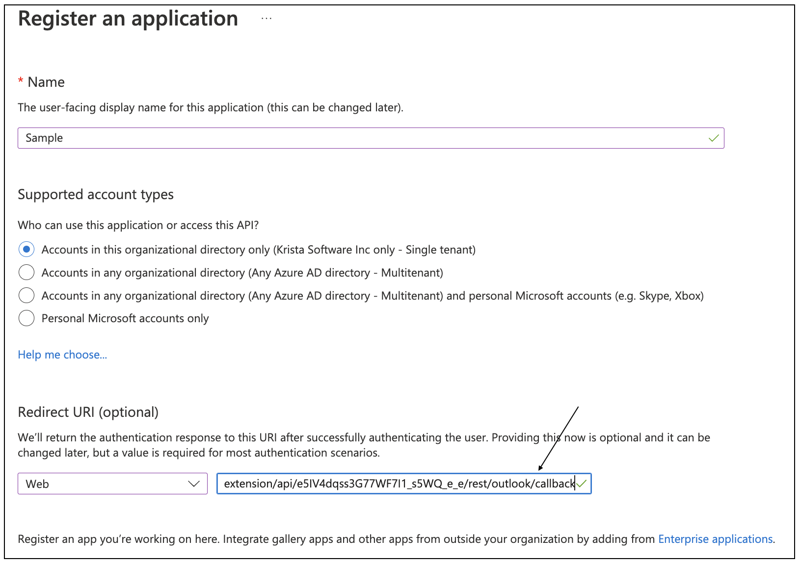
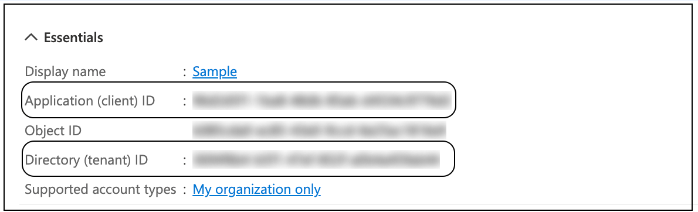
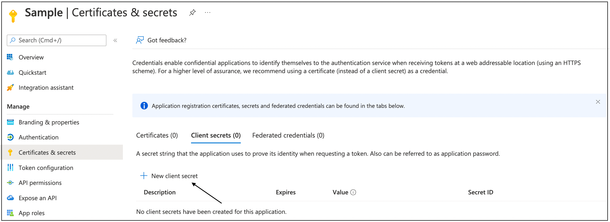

[< back](connectingWithOutlookExtension.md)

# Obtaining Credentials For Private Authentication

* For the Outlook Extension, you would need to obtain Client ID, Tenant ID, and Client Secret from the Azure Portal.

### Steps to get Client ID, Tenant ID, and Client Secret

* Log in to the Azure portal. To see related information, [click here](https://portal.azure.com/).
  

* Under **Azure services**, click **Azure Active Directory**. If not found readily click **More services** to find Azure
  Active Directory.
  

* On the following Overview page, click **App registrations** under the **Manage** column menu.
  

* At the top of the page, click **New Registration**. Alternatively, open your pre-existing application.
  

* **Register an application** page is displayed. Enter the relevant details on this application page. Enter the **Name**
  that would be display name. Select the **Supported account types**. Out of the available options, select accounts in
  the single tenant only (first option).

* Under Redirect URI, select the Web platform. Add the authorized redirect URI
  corresponding to your Outlook extension which you have copied from Details tab. Click **Register**.
  

* After registration, in **Overview**, under **Essentials**, you will find the Client ID and Tenant ID.
  

* Click **Certificates & secrets**, go to and click **New client secret**.
  

* On the **Add a client secret panel**, enter the **Description**, and set up the time span of expiry in the **Expires**
  field. Click **Add**.
  

* On the following page, you will see the Client Secret under **Value**.
  

* Save the Client ID, Tenant ID, and Client Secret for future reference.

* You must provide these values in your extension to proceed with the operations such as catalog requests and invoker
  request.
