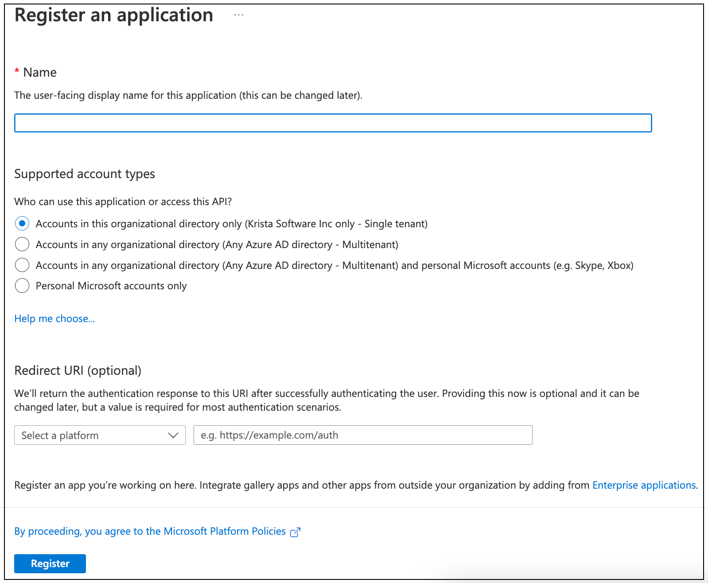
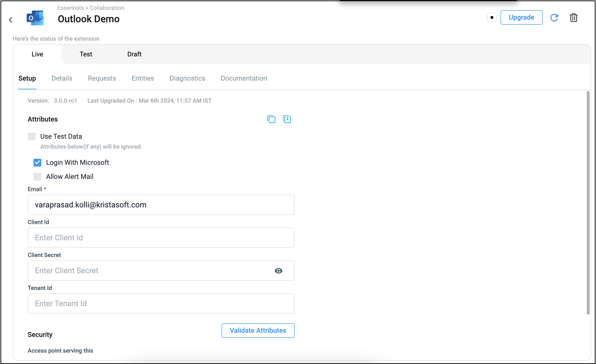

# Private Authentication Guide


This comprehensive guide helps IT administrators set up Private Authentication for the Krista Outlook Extension using your organization's own Azure App Registration.

## What is Private Authentication?

Private Authentication uses your organization's own Microsoft Azure App Registration with OAuth 2.0 Authorization Code Grant flow. This gives you complete control over the authentication process, higher API limits, and enhanced security monitoring.


## OAuth 2.0 Technical Specifications

### Grant Type and Flow

Private Authentication uses the **Authorization Code Grant** flow, the most secure OAuth 2.0 flow for web applications:

```
Grant Type: authorization_code
Flow: Authorization Code with PKCE (Proof Key for Code Exchange)
Client Type: Confidential Client
Authentication Method: Client Secret
```

### Required Endpoints
```
Authorization Endpoint: https://login.microsoftonline.com/{tenant-id}/oauth2/v2.0/authorize
Token Endpoint: https://login.microsoftonline.com/{tenant-id}/oauth2/v2.0/token
Microsoft Graph API: https://graph.microsoft.com/
```

### Required OAuth 2.0 Configuration
```json
{
  "grant_type": "authorization_code",
  "response_type": "code",
  "scope": "https://graph.microsoft.com/Mail.Read https://graph.microsoft.com/Mail.Send https://graph.microsoft.com/User.Read offline_access",
  "redirect_uri": "https://your-krista-instance.com/outlook/v3/oauth/callback",
  "client_authentication": "client_secret_post",
  "pkce": true
}
```

## Azure App Registration Setup

### Step 1: Create New App Registration


1. **Access Azure Portal**
   - Navigate to portal.azure.com
   - Sign in with your Azure administrator account
   - Go to **Azure Active Directory**

2. **Start App Registration**


3. **Configure Basic Settings**
   ```
   Name: Krista Outlook Extension - [Your Organization]
   Supported account types: Accounts in this organizational directory only
   Redirect URI: Web - https://your-krista-instance.com/outlook/v3/oauth/callback
   ```



### Step 2: Configure API Permissions

1. **Navigate to API Permissions**
2. **Add Microsoft Graph Permissions**:


   ```
   Delegated Permissions:
   - Mail.Read (Read user mail)
   - Mail.Send (Send mail as a user)
   - Mail.ReadWrite (Read and write access to user mail)
   - User.Read (Sign in and read user profile)
   - offline_access (Maintain access to data you have given it access to)
   ```


3. **Grant Admin Consent**
   - Click **"Grant admin consent for [Your Organization]"**
   - Confirm the consent grant
   - Verify all permissions show "Granted" status

### Step 3: Create Client Secret


1. **Navigate to Certificates & secrets**
2. **Create New Client Secret**:


   ```
   Description: Krista Outlook Extension Secret
   Expires: 12 months (recommended)
   ```

3. **Copy Secret Value**


   - **Important**: Copy the secret value immediately
   - Store it securely - you won't be able to see it again
   - This will be your `Client Secret` in Krista configuration

### Step 4: Get Application Details


1. **Navigate to Overview**
2. **Copy Required Values**:
   ```
   Application (client) ID: [Copy this value]
   Directory (tenant) ID: [Copy this value]
   ```

### Step 5: Configure Authentication Settings

1. **Navigate to Authentication**
2. **Configure Advanced Settings**:
   ```
   Access tokens: Checked
   ID tokens: Checked
   Allow public client flows: Unchecked (for security)
   ```

3. **Add Additional Redirect URIs** (if needed):


   ```
   https://your-krista-instance.com/outlook/v3/oauth/callback
   https://your-krista-instance.com/rest/outlook/v3/oauth/callback
   ```

## Krista Configuration

### Step 1: Access Krista Extension Settings


1. Log into your Krista platform
2. Navigate to **Extensions** → **Outlook Extension**
3. Click **"Add New Connection"** or **"Configure"**

### Step 2: Configure Private Authentication

1. Select **"Private Authentication"** radio button
2. Fill in the required fields:
   ```
   Email: user@yourorganization.com
   Client ID: [From Azure App Registration]
   Client Secret: [From Azure App Registration]
   Tenant ID: [From Azure App Registration]
   Allow Mail Alert: [Optional checkbox]
   ```


### Step 3: Test and Save Configuration
1. Click **"Test Connection"**
2. Complete the authentication flow
3. Click **"Save Changes"** when test succeeds

## User Authentication Process

### For End Users



When users authenticate with Private Authentication:

1. **Initiation**: User clicks "Connect to Outlook" in Krista
2. **Organization Login**: Redirected to your organization's login page
3. **Custom Branding**: Sees your organization's name in consent screens
4. **Enhanced Security**: Benefits from your organization's security policies
5. **Conditional Access**: Respects your organization's access rules

## Benefits of Private Authentication

### Enhanced Control
- **Custom Branding**: Your organization's name appears in all consent screens
- **Centralized Management**: IT controls all aspects of the integration
- **User Assignment**: Control which users can access the application
- **Audit Trails**: Comprehensive logging of all authentication events

### Higher Limits
- **Dedicated API Quota**: Your own Microsoft Graph API limits
- **Increased Throughput**: Higher rate limits for email processing
- **Better Performance**: No sharing of resources with other organizations
- **Scalability**: Supports large-scale enterprise deployments

### Additional Benefits
- **Dedicated Resources**: Your own API quota, not shared
- **Custom Branding**: Your organization's name in consent screens
- **Enhanced Monitoring**: Detailed usage analytics and audit logs
- **Conditional Access**: Integration with your organization's security policies
- **Compliance**: Meets enterprise security and governance requirements

## Common Issues and Solutions

### 1. Email Domain Mismatch

**Issue**: Users can't authenticate with emails from different domains
**Cause**: App registration configured for single tenant
**Solution**:
```
Required Actions:
1. Verify app registration is set to correct account types
2. For multi-domain organizations, consider multi-tenant configuration
3. Ensure user's email domain is part of your Azure AD tenant
```

### 2. Permission Consent Errors


**Issue**: "AADSTS65001: The user or administrator has not consented to use the application"
**Cause**: App registration lacks required permissions or admin consent not granted
**Solution**:
```
Required Actions:
1. Verify all required permissions are added to app registration
2. Grant admin consent for the organization
3. Ensure permissions include:
   - Mail.Read (Delegated)
   - Mail.Send (Delegated)
   - Mail.ReadWrite (Delegated)
   - User.Read (Delegated)
   - offline_access (Delegated)
```

### 3. Redirect URI Mismatch

**Issue**: "AADSTS50011: The reply URL specified in the request does not match the reply URLs configured for the application"
**Cause**: Redirect URI in Azure doesn't exactly match Krista's callback URL
**Solution**:
```
Correct Redirect URIs to add:
- https://your-krista-instance.com/outlook/v3/oauth/callback
- https://your-krista-instance.com/rest/outlook/v3/oauth/callback

Common Mistakes:
❌ http:// instead of https://
❌ Extra trailing slash
❌ Wrong domain or path
❌ Missing port number if non-standard
```

### 4. Client Secret Expiration

**Issue**: Authentication suddenly stops working
**Cause**: Client secret has expired
**Solution**:
```
Prevention and Resolution:
1. Set calendar reminders before secret expiration
2. Create new client secret before old one expires
3. Update Krista configuration with new secret
4. Test connection after updating
5. Consider using certificates instead of secrets for longer validity
```

### 5. Tenant ID Configuration

**Issue**: "AADSTS90002: Tenant not found"
**Cause**: Incorrect tenant ID in Krista configuration
**Solution**:
```
Verification Steps:
1. Copy tenant ID exactly from Azure App Registration Overview
2. Ensure no extra spaces or characters
3. Verify tenant ID format (GUID format: xxxxxxxx-xxxx-xxxx-xxxx-xxxxxxxxxxxx)
4. Test with Microsoft Graph Explorer using same tenant ID
```

### 6. Client ID Issues

**Issue**: "AADSTS700016: Application with identifier was not found"
**Cause**: Incorrect client ID or app not properly registered
**Solution**:
```
Troubleshooting Steps:
1. Verify client ID from Azure App Registration Overview
2. Ensure app registration is in correct Azure AD tenant
3. Check if app registration was accidentally deleted
4. Verify client ID format and ensure no typos
```

### 7. Conditional Access Blocking

**Issue**: Users can't complete authentication due to conditional access policies
**Cause**: Organization's conditional access policies blocking the application
**Solution**:
```
Policy Review:
1. Review conditional access policies in Azure AD
2. Add Krista application to trusted applications if appropriate
3. Configure device compliance requirements
4. Consider location-based access rules
5. Test with different user accounts and devices
```

### 8. User Assignment Issues
**Issue**: "AADSTS50105: The signed in user is not assigned to a role for the application"
**Cause**: App requires user assignment but user isn't assigned
**Solution**:
- In Azure Portal, go to Enterprise Applications
- Find your Krista app registration
- Go to Users and Groups
- Assign appropriate users or groups
- Or disable "User assignment required" if appropriate

### 9. Multi-Factor Authentication Problems
**Issue**: Authentication fails during MFA challenge
**Cause**: MFA configuration or policy issues
**Solution**:
- Verify user's MFA methods are properly set up
- Check conditional access policies for MFA requirements
- Ensure app is configured to handle MFA flows
- Test MFA with other applications

### 10. Guest User Limitations
**Issue**: External users cannot authenticate
**Cause**: Guest user restrictions or configuration
**Solution**:
- Configure external collaboration settings in Azure AD
- Enable guest user access for the application
- Verify guest users have appropriate licenses
- Check if guest user redemption is required

## Security Best Practices

### App Registration Security

- ✅ Use certificate-based authentication instead of client secrets when possible
- ✅ Set appropriate client secret expiration (12-24 months maximum)
- ✅ Implement proper secret rotation procedures
- ✅ Limit permissions to minimum required scope
- ✅ Enable audit logging for all app activities

### User Management
- ✅ Implement conditional access policies
- ✅ Require multi-factor authentication
- ✅ Monitor sign-in logs regularly
- ✅ Use privileged identity management for admin roles
- ✅ Implement device compliance requirements

### Ongoing Maintenance
- ✅ Monitor app usage and performance
- ✅ Review and rotate secrets before expiration
- ✅ Audit permissions and user assignments quarterly
- ✅ Keep documentation updated
- ✅ Test authentication flows after Azure AD changes

## Monitoring and Troubleshooting

### Azure AD Monitoring

1. **Sign-in Logs**: Monitor authentication attempts and failures
2. **Audit Logs**: Track permission changes and app modifications
3. **Application Logs**: Review app-specific events and errors
4. **Usage Analytics**: Monitor API usage and performance

### Key Metrics to Monitor
- Authentication success/failure rates
- API request volumes and patterns
- Token refresh frequency
- User adoption and usage patterns
- Error rates and types

### Troubleshooting Tools

- **Azure AD Sign-in Logs**: Detailed authentication flow analysis
- **Microsoft Graph Explorer**: Test API calls and permissions
- **Azure AD App Registration Test**: Validate OAuth flows
- **Browser Dev Tools**: Network traffic analysis

## Migration from Public to Private

### Planning the Migration
1. **Assess Current Usage**: Document existing Public Authentication users
2. **Create Azure App Registration**: Follow setup process above
3. **Test with Pilot Users**: Validate configuration with small group
4. **Plan User Communication**: Inform users about the change
5. **Schedule Migration**: Choose appropriate timing

### Migration Steps
1. **Prepare Private Authentication**: Complete Azure setup
2. **Test Configuration**: Verify everything works correctly
3. **Communicate to Users**: Provide migration instructions
4. **Migrate Users**: Have users re-authenticate with Private method
5. **Verify Migration**: Ensure all users successfully migrated
6. **Cleanup**: Remove old Public Authentication configurations

Your Private Authentication setup provides enterprise-grade security, control, and performance for your organization's email automation needs!